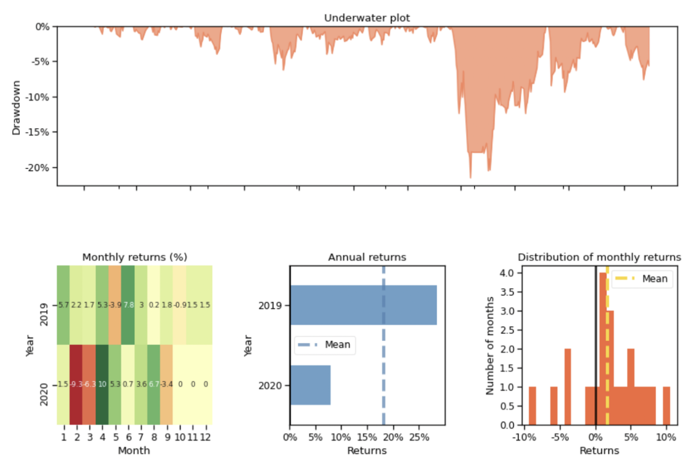

## SECTION 1 : IRS-PM-ISY5002-2022-10-26-GROUP19-Finance-Tool
## Finance-Tool

---  

## SECTION 2 : EXECUTIVE SUMMARY / PAPER ABSTRACT

Finance serves a purpose. ... Investors are lured to gamble their wealth on wide hunches originated by charlatans and encouraged by mass media. One day in the near future, ML will dominate finance, science will curtail guessing, and investing will not mean gambling. Our mission is to set up a system to efficiently automate trading.

- Help Users make decisions.
- Make the Profit maximum.
- Generate Users Financial Report.

We use multiple Deep Reinforcement Learning algorithm to train the policy and Q-value. The users just load our pre-trained models and the system will return the accumulative profit and everyday actions.We believe applying these intellectual and engineering system to finance will initiate a paradigm shift from the conventional trading routine to an automated machine learning approach, even RLOps in finance.
\\Deep Reinforcement Learning is a type of supervised machine learning. However, DRL doesn’t need large labeled training datasets. This is a significant advantage since the amount of data grows exponentially today, it becomes very time-and-labor-consuming to label a large dataset. DRL uses a reward function to optimize future rewards, in contrast to an ML regression/classification model that predicts the probability of future outcomes.

---

## SECTION 3 : CREDITS / PROJECT CONTRIBUTION

| Official Full Name  | Student ID (MTech Applicable)  | Work Items (Who Did What) | Email (Optional) |
| :------------ |:---------------:| :-----| :-----|
| Yang Wenkai | A0261636A | Backend Application Deveopment, Algorithm/Model Development and Training | yangwenkai666@outlook.com |
| Huang Runxiang | A0261627A | Backend Application Deveopment, UI/UX Development| runxiang.huang@u.nus.edu |
| Chen Haoyang | A0261905E | Backend Application Deveopment, UI/UX Development | Hapyangc0308@gmail.com |

---

## SECTION 4 : VIDEO OF SYSTEM MODELLING & USE CASE DEMO
`Please refer to the video at Youtube`

`<Video Link>` : <https://www.youtube.com/watch?v=OVacIsCKnGA>

---

## SECTION 5 : USER GUIDE

### Installation
Run this command in your termainal `pip install -r requirements.txt`

### Run Code
`cd finance-tool`

`streamlit run home.py`

Copy your Local URL in your web browser.

### Run it on Internet
You can also visit our website by click https://sezer12138-finance-tool-home-rnjqsu.streamlitapp.com/

---
## SECTION 6 : PROJECT REPORT / PAPER
`Please refer to Project report at Github Folder: Project_Report`

`<File Link>` : <https://github.com/sezer12138/finance-tool/blob/main/Project_Report.pdf>

---
## SECTION 7 : MISCELLANEOUS
`Please refer to the Jupyter Notebook 'Train.ipynb' for data analysis at Github Folder: Algorithms`

`<File Link>` : <https://github.com/sezer12138/finance-tool/blob/main/Algorithms/Train.ipynb>

---

